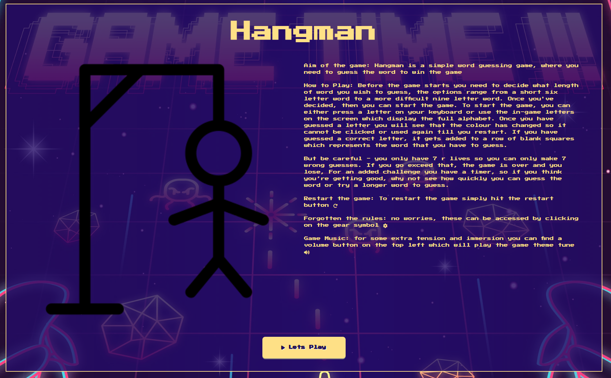

# Hangman Game

## About the Project


- I have re-created one of the classic games that everybody has either heard about or played - hangman. The idea of the game is quite simply, you are presented with a number of blank squares which represent the letters in the word that you need to guess. You then have to pick a letter and if the word contains the letter, then it will appear on the screen but be careful, if the letter is not included then you’ll be one step closer to losing and the man being hung.

- To add in some extra level of complexity, to give the game more features and to improve reliability, I have added in a number of features and extra elements which the user can interact with. Sound has been used to improve thew immersive experience for players. Sounds can play during the course of the game and at the end when the user loses or wins. There is also the visual aspect that has been created to make the game feel like an 80’s arcade game.

[Live Website Link](https://gmontaque.github.io/hangman-game/)

## Target Audience

**What was the idea behind building the product?**

- To allow users to be able to play hangman in a fun environment
- To allow users to play a relaxed game
- Allow users to unlock fun memories of playing hangman
- Make new memories and to allow them to play the game with others

**Who is the user**

- User can be any age or gender
- User will be a gamer
- User is looking for an easy game which can be played with minimal instructions needed

**What are the needs/wants of the users?**

- Game must be easy to navigate
- Game must have simple controls and so that all ages can use the site and play the game
- Game must be replayable
- Game must cater to different skill levels
- User is not looking for something technical

**What are the needs/wants of the business?**

- To create a game that users enjoy
- A game that users want to come back to and play again and again
- A game that the users do not get bored of or lose interest in
- Game should feel fresh to users each time
- Game should be immersive for the user through sounds and images

**How does the site meet the needs of user and business**

- A person with an interest in classic games will find the site interesting and engaging due to the visual and sound effects
- The game has been made easy to play with simple buttons and icons
- A description/game rules have been included so that the business can easily and effectively describe the site and explain how to use it
- SEO has been included throughout the site to make it easier for users to find and to allow the business to better describe the site
- The game has been created so that it can be played again and again helping to keep the user engaged
- Difficulty levels have also been included to add a challenge for users and give them a goal

## Website Features

**Game Rules**

- This is a feature which can be found on the initial webpage when the site loads. The purpose of this feature is to provide the users with a description of the game and the game rules.
- As well as the text, there is also an image included to provide a visual aid as some users find it easier to absorb information when viewed as an image rather than reading it. The image used is a hangman image.


**Game Music**

- The music button is included on the game page and can be found top left.
- When pressed this will play the theme tune which from the 80’s and is in keeping with the 80’s feel


**Game Page**

- Access to the game is on this page
- The page includes buttons that the user can interact with and a range of features for their enjoyment


**Home Page Button**

- Takes the user back to the homepage
- A icon of a house has been used as a visual effect to denote a home button


**Game Sounds**

- 3 different game sounds have been incorporated into the game.
- These sounds have been included to give the user auditory confirmation of how well they have done
- The sounds are also used to increase immersion and to improve enjoyment when playing
- The 3 sounds indicate game play, game won or game lost

**Stop Watch**

- The stop watch appears at the top of the game page
- This is activated when the user starts the game and provides an added level of complexity and challenge to the game
- The stop watch will run until the user either wins or loses and will show the user the length of time they took to guess the word


**Word length generator**

- I have created a drop down where the user can select the length of word that they wish to guess
- If the user does not make a selection, then there is a default word length which has been included
- The word length selector is linked to an API which when called upon will return a word of the length that was specified in the selector element


**Lives Left**

- This function is linked to a letter checker function which checks if the letter selected is in the word being guessed
- The value of lives left will reduce for every wrong guess that the user makes until it reaches zero
- Once lives left hits zero the game will end and a ‘game over’ overlay element will appear followed by a sound track to make it clear to the user they have lost
- The end game message also shows the user the word they were trying to guess


**Game Rules Overlay**

- If a user needs to look up the rules this can be done by clicking on the rules button
- When clicked upon, the button will show an overlay which will contain the games rules
- To close the game rules overlay, the user must click on the button displayed.
- The overlay allows users to check the rules without having to go back to the homepage


**Blank Squares**

- When the user first loads the game page, they will be greeted by a number of blank squares with question marks inside them
- These are auto-generated when the page loads, by calling the API and printing a blank square for each letter within the returned API word
- If a different length of word is selected from the selector element, then the API is called again and the blank squares will update to the new word length to be guessed


**Alphabet Letters**

- When the game page loads, a function is called upon which prints all 26 letters to the screen
- These are the letters that the user will click to start the game
- When a user clicks a letter, they will see that it changes colour and is disabled to visually show the user which letters they have left to guess from
- Depending on if the user guesses the correct letter or incorrect letter the button will change to a specific colour.
- An added feature is that the user can choose to select their letter using the keyboard instead of selecting one from the screen. This will work just as well and the game will run


**Incorrect Letter Guess**


**Correct Letter Guess**


**Restart Game**

- This function will restart the entire game without the user having to refresh the page
- The function will reset all alphabet letters which currently are disabled and have had an alternative colour added
- It will reset the canvas area
- It will reset the stop watch and reproduce the blank squares


**Hangman Canvas**

- The canvas area is a visual area which will show the hangman image as it progresses to being fully complete
- Depending on if the user guesses a correct or incorrect letter, the hagman image is updated accordingly


**404 Page**

- This page has been added to improve user experience
- If the user types an incorrect web address they will be greeted with this page
- The page will re-direct the user back to the official website page


## Page Breakdown

### HOME Page

- Below you will see an image of the landing page which the user will see when loading up the webpage. It contains the following features:
  - The rules of the game, this will allow users to understand how to play the game
  - A visual image of the game to be played is displayed making it easier for the user to understand the game along with the written rules
  - The title of the game
  - A button which will take the user to the game page



### Game Page

- The game page is what the user sees when they navigate from the home page to the game page. It contains the following features:
  - The game page is what the user sees when they navigate from the home page. It contains the following features:
  - The title of the game
  - The toggle music button which plays the game tune which will allow the user a higher level of immersion in the game and improve their enjoyment
  - A stopwatch will add a challenge to the game
  - A selector drop-down, allowing the user to choose the word length and provide more variety to the game
  - A counter for the number of lives left which will add a challenge as the user will not have unlimited guesses
  - An icon which shows the games rules when clicked, which will allow the user to refresh their memory of the rules if needed
  - A game reset button will make sure the game is replayable
  - Blank squares representing letters to guess, visually indicates to the user the length of the word and letters to guess
  - 26 alphabet letters which are buttons that the user can click to play the game have been included, they provide feedback when pressed as they will change colour depending on if the letter guessed is correct or not. This will visually show to the user which letters have already been guessed
  - Sound effects have been included as a toggle button option which are played at the end of the game, this adds a fun aspect to the game as well as auditory feedback on how well they have done


### 404 Page

- This is the 404 page which has been added to direct users back to the main website when they input the incorrect web address


## Technologies Section

- HTML5 – used to create the content and structure of the website
- CSS – used to add styling to the html structure
- JavaScript – used to provide functionality and make the site dynamic
- Gitpod – a cloud development environment
- GitHub – a code hosting platform for version control, collaboration and editing websites
- Mockflow – used to create the wireframes
- VS Code Desktop – IDE used to code the website
- Google fonts – used for importing website fonts
- Font awesome – used to add icons to the website

## Typography and Colour Scheme

**Font**

- For the font, I have used Press Start 2P google font link [Google Font Link](https://fonts.google.com/specimen/Press+Start+2P?preview.text=A%20B%20C%20D%20E)
  - I have used this font because it complemented my 80’s game theme
  - I also sought to copy and mimic the background which has some text in a certain style
  - I also wanted the text to add to the feeling of a classic, retro game


**Colour Scheme**

- The theme of the website is 80s, arcade and classic gaming
- In keeping with this theme, I used colours and images reminiscent of that era
- For the main text colour, I have used #fee086
- For the background colour I have used #240B67 and in some areas added in opacity as well, to make the text clear to read
- I have checked it against a colour contrast checker and it passed


## Wireframes

### Home Page

- The function of the homepage is to make sure that the user is aware of what website they have clicked on and what to expect
- It also includes important information so the user is aware of how to play the game and also what to expect
- The page should contain the rules of the game, explain the game page and icons
- The homepage should have a visual aspect to go with the written explanation
- The image below shows the different styling and orientation of the homepage depending on if the user is on a mobile, Desktop or another device
- Image includes desktop and mobile wireframe examples


### Game Page

- This is the page on which the user will play the game, after going through the homepage and reading the rules
- The home button is next to the title and is used to go back to the home page
- Going from top left to right there is:
- A music button allowing the user to play game music
- A timer, included for an added challenge to allow the user to time how long it takes them to guess a word
- An the far right is a drop down, where the user can select the word length to guess

- The main game area contains the image of the hangman made using canvas, then a lives left counter, a gear button to access the games rules overlay and a reset button
- Next to the hangman image are a selection of blank squares which represent the letters to be guessed
- There is also a full 26 letter keyboard the user can click to select their next guess or they could choose to use their keyboard
- Image includes desktop and mobile wireframe example


## Testing

- The testing that i have completed for can be found in the following file
  - [Website Testing](websiteTesting.md)

## Performance Improvements

- When testing the website on Pagespeed, I found there was a reduction in performance. To resolve this, I updated all images to webp
- The reduction in the size of the image results in a faster website loading time without a loss of quality.
- Other benefits include reduced bandwidth
- Another performance improvement I made was with the sound files, all sound files were compressed in size to improve performance.

## SEO

- To improve the SEO side of the website I have included the following code.
- I have added a meta section which includes certain keywords, When a user searches these words there is a higher chance that my site will appear in the search results
- There is also a title included which will be picked up by Google when a search is completed

  ```
  <!-- title and tab icon -->
    <link
      rel="icon"
      type="images/x-icon"
      href="assets/img/hangman-placeholder-img.webp"
    />
    <title>Hangman</title>
    <!-- Meta tags for search engines -->
    <meta
      name="description"
      content="hangman, classic games, 80s games, fun games, quick games"/>
    <meta
      name="keywords"
      content="80's, classic games, hangman, single platyer"/>
  ```

## Website Deployment

### Deploying the Website to GitHub Pages

- The website was deployed to GitHub Pages using the following steps:
- In the GitHub repository, go to the "Settings" tab.
- From the left-side menu, select 'Pages.'
- In the source section drop-down menu, choose the 'main' branch.
- Click 'Save.'
- Upon successful publishing, a live link will be displayed in a green banner.

### Cloning the Repository

- Click on the "Code" button located near the top right corner of the page.
- Copy the HTTPS or SSH URL displayed.
- Open your terminal (or Git Bash on Windows) and navigate to your desired directory.
- Enter "git clone" followed by a space, and paste the copied URL.
- Press enter to execute the command, creating a local copy of the GitHub repository.
- You now have the GitHub repository cloned to your local machine.
- Cloned local repo can be run in your browser

### Forking the Repository

- Click the "Fork" button found near the top right corner of the page. This duplicates the repository into your GitHub account.
- After forking, you will be redirected to your forked repository.
- If not already done, clone the forked repository to your local machine, using the instructions mentioned earlier.
- Make any desired changes or additions to the code in your local copy of the repository.
- Commit your changes to your local repository using the "git commit" command.
- Push your changes to the forked repository on GitHub with the "git push" command.
- If you intend to contribute your changes back to the original repository, initiate a pull request. You can do this by going to the original repository's page and selecting the "New pull request" button. From there, you can compare your changes to the original repository and request a merge.
- You now have a forked copy of the GitHub repository in your account, allowing you to make changes and contribute back to the original repository if desired.

## Credit and Content

### Icons

- All icons used in the website were taken from FontAwesome [Font Awesome](https://fontawesome.com/)

### Sound Tracks

- Main game music - https://www.fesliyanstudios.com/royalty-free-music/download/retro-platforming/454
- The loosing sound track - https://pixabay.com/sound-effects/wah-wah-sad-trombone-6347/
- Winning sounds track - https://pixabay.com/sound-effects/tadaa-47995/

### Stop Watch

- For the stop watch I took inspiration from the following code example - https://codepen.io/cathydutton/pen/xxpOOw

### Button Style

- https://codepen.io/reulison/pen/WNNVPZq?editors=1100

### Random Word API Generator

- https://random-word-api.herokuapp.com/home

### Media and Images

- The background image as sourced from FREEPik - https://www.freepik.com/free-vector/gradient-video-game-background_40128350.htm#query=80s%20video%20game&position=2&from_view=search&track=ais&uuid=18d90939-c56b-4bc6-b376-af915d897243
- The hangman canvas image - https://codepen.io/xavier_bs/pen/MMNGyG
- Homepage hangman image - https://board-game-art.fandom.com/wiki/Hangman?file=Hangmanlogo.png
