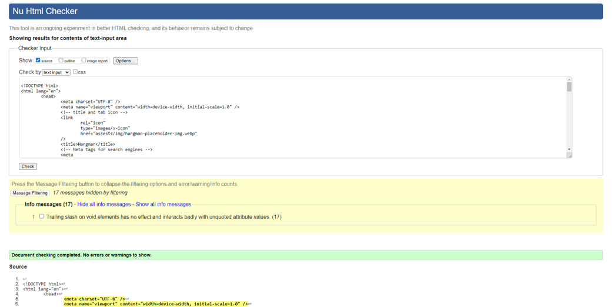
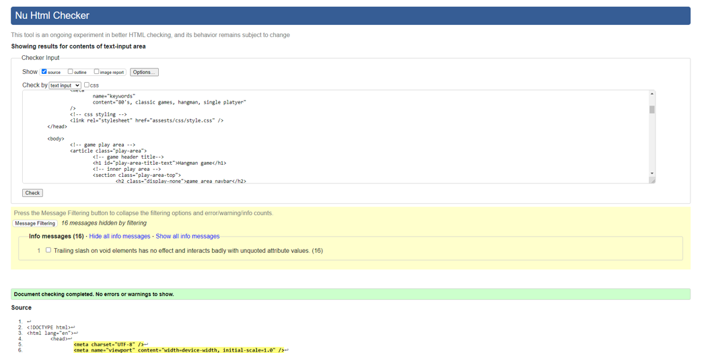

## Testing

### Browser Compatibility

- I have tested the website in different browsers such as google, Firefox and Edge
- On each browser, I have gone into the dev tools and tested the website at different screen sizes, from mobile to full size. Examples below from Firefox and Edge:


### Detailed Testing

| Test                                       | Test Description                                                                                                                                                                                                                                                                                                           | Result |
| ------------------------------------------ | -------------------------------------------------------------------------------------------------------------------------------------------------------------------------------------------------------------------------------------------------------------------------------------------------------------------------- | ------ |
| Website loads                              | When the URL is entered the website should load the homepage and all its content correctly                                                                                                                                                                                                                                 | Pass   |
| Homepage play game button                  | When the button is clicked it should take the user to the game page                                                                                                                                                                                                                                                        | Pass   |
| Homepage responsiveness                    | When the screen size is changed the website should change and update with the correct sizing                                                                                                                                                                                                                               | Pass   |
| Gamepage – music button                    | When the button is clicked it should play the game sound track and it should also change the icon image. The button should toggle between off and on.                                                                                                                                                                      | Pass   |
| Gamepage – home button                     | When the button is click it should take the user back to the home page                                                                                                                                                                                                                                                     | Pass   |
| Gamepage - stopwatch                       | When the game is started the stop watch should start, it should then pause when the game ends and store the result. When the game is restarted, it should reset to zero                                                                                                                                                    | Pass   |
| Gamepage – word length                     | It should return a default number value when the game page loads to be used by the api, if updated by the user it should also update the return value.                                                                                                                                                                     | Pass   |
| Gamepage – lives left                      | This should track the number of wrong guesses, if this value goes to zero the user should lose the game and an overlay should be displayed along with a game lost sound played                                                                                                                                             | Pass   |
| Gamepage – game rules                      | When the user clicks on the button, an overlay should appear with the game rules, and all the content should be styled and appear correctly                                                                                                                                                                                | Pass   |
| Gamepage – game rules overlay close button | When the game rules overlay is open, you should be able to close this using the close button in the overlay                                                                                                                                                                                                                | Pass   |
| Gamepage – game restart button             | Clicking on the button should restart the game, this means resetting the stopwatch, resetting the alphabet letter buttons and the blank squares, getting a new word to guess from the api, remove the disable attribute from alphabet buttons, get number value from word length select element and reset the canvas       | Pass   |
| Gamepage – canvas                          | When the user guesses a wrong letter the canvas image should update                                                                                                                                                                                                                                                        | Pass   |
| Gamepage – Blank Squares                   | When the game page loads it should load in an x number of blank squares with a question mark inside. Length is dependant on the value of the word length select element                                                                                                                                                    | Pass   |
| Gamepage – Alphabet letters                | When the game page loads it should load up the 26 alphabet letters                                                                                                                                                                                                                                                         | Pass   |
| Gamepage – Alphabet letters function       | When a letter is pressed it should be checked to see if the letter is contained in the word being guessed. If it is, the blank squares should be updated with the letter. If an incorrect guess is made the canvas image should be updated and lives left reduced. It should also disable the word length selector element | Pass   |
| Gamepage – disable letter                  | After a user presses a letter, they wish to guess, the button should be disabled and the user should not be able to guess or select that letter again until the game resets.                                                                                                                                               | Pass   |
| Gamepage – keyboard letter press           | When a keyboard alphabet letter is pressed, the game should work the same and start - just as if one of the onscreen button letters had been pressed                                                                                                                                                                       | Pass   |
| Gamepage responsiveness                    | When the screen size is changed the website should change and update with the site                                                                                                                                                                                                                                         | Pass   |
| 404 page                                   | When the incorrect web address is entered the user should be re-directed to the 404 page                                                                                                                                                                                                                                   | Pass   |
| 404 page – home button                     | When clicked the user should be return to the homepage of the website                                                                                                                                                                                                                                                      | Pass   |
| Gamepage responsiveness                    | When the screen size is changed the website should change and update with the site                                                                                                                                                                                                                                         | Pass   |

### Issues and Bugs

**Error 1**

- When the user plays the game there is a counter that records the number of correct letters that the user has guessed and this is compared against the word length to be guessed. When they match it confirms that the user has guessed the full word, the counter is decreased by one each time the user guesses a correct letter. The issue that was being faced was that the counter was not updating correctly, the user could get the full word correct, but the game would keep running and would not show the winner screen.

- The issue was related to how the checkAnswer function. It was meant to reduce the lettersleftoguess variable by one when a certain condition was met. I found that I had not correctly added the variable name to the correct “IF” statement, so was not running at the correct point in the function.

**Error 2**

- Included in the website is an API, the purpose of the API is to return a word that the user has to guess to win the hangman game. If the user lost the game, the word the user was trying to guess was meant to show within the website, but when the value was printed to the screen it would show as an array. When checked using “typeof” it stated that the value was a string.
- I had initially tried to turn the value to a string but as it was already a string it did not change the output value. Instead, the solution came when I used the splice function on the initial value to remove the first two values in the printed result which was a square bracket and the quotation mark which resolved the issue.

**Error 3**

- When the user finishes the game, the stopwatch is meant to pause and show the current length of time that has elapsed since the user started playing the game. The idea being, that the user can see how long it took for them to guess the word and by adding this level of complexity, make them want to try again. The issue I was having is that when the user finished the game and then wanted to restart the game, the stop watch would also restart and would not store the value.
- To solve this issue, I had to add some code into the win or lose function. The code would take the current value of each set of numbers i.e. minutes, seconds and milliseconds and would update the stop watch with those static figures.

**Error / Bug**

- This error was first found by my mentor when testing the website, the error would occur when rapidly pressing a letter key on the keyboard. It would then print an error to the console.
- The error was intermittent and it was unclear the reason for the error.
- On further testing it looked to happen when refreshing the webpage by pressing control, shift and R, the issue seemed to be that by pressing R it was calling an event listener on the keyboard letter press
- To resolve this issue I added the keyboard event listener to the window.onload function so that it will not run until the page is fully loaded, this seemed to solve the issue but I have had difficulty replicating the issue as it does not fully occur on my system.


**Select Element Bug**

- When running my code through PageSpeed my accessibility score for the game page returns 95, when checking the accessibility section it states the reason for not getting 100 is that the “Select elements do not have associated label elements.”. I have spoken to my mentor and he suggested wrapping the select element inside a form element along with the label but the bug still persists, the JavaScript code validates 100%.


- As you can see from the code snippet a label has been included correctly

```
<form class="play-area-top-word-select">
	<label for="guess-word" class="display-none">
      Choose the word length
    </label>
	<select name="guess-word" id="guess-word">
		<option value="6">Word Length: 6</option>
		<option value="7">Word Length: 7</option>
		<option value="8">Word Length: 8</option>
		<option value="9">Word Length: 9</option>
	</select>
</form>
```

### Lighthouse Test

- I have used lighthouse to test the website as per the image below:

**Home Page**


**Game Page**


**404 Page**


### Validator Testing

- I have tested all HTML pages on the HTML validator and there are no errors

- When building the website, I have used an extension called prettier which has resulted in the warnings that you can see on each screenshot below:

  - No errors were returned when passing through the official [W3C validator](https://validator.w3.org/nu/?doc=https%3A%2F%2Fcode-institute-org.github.io%2Flove-running-2.0%2Findex.html)


**Home Page**



**Game Page**



**404 Page**


**CSS Validation**

- When testing the website there are no errors

  - Result from the CSS validator [(Jigsaw) validator](https://jigsaw.w3.org/css-validator/validator)


**Javascript Validation**

- When testing the website there are no errors and it passes validation

  - Result from the Javascript validator [jshint](https://jshint.com/)


- When testing the website on different devices I have used the pre-defined dimensions that come with the developer tools on Google Chrome
- I have also researched several websites which have described the most common screen size for devices in 2023 for desktop and mobile - https://www.designrush.com/agency/web-development-companies/trends/website-dimensions


### Game Testing

- When testing the website, to confirm the correct word to be guessed and also confirm the letter that the user pressed, the following code can be added to the `checkLetterGuess` function inside the try statement.

  ```
  console.log("Word to guess is:",wordToGuess,",","User Letter guess is:",uGuess);
  ```
